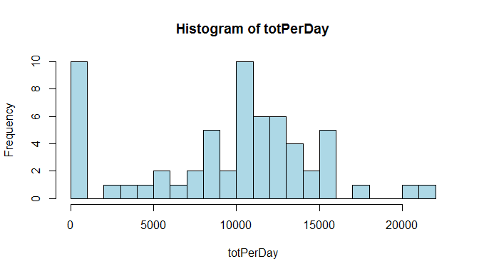
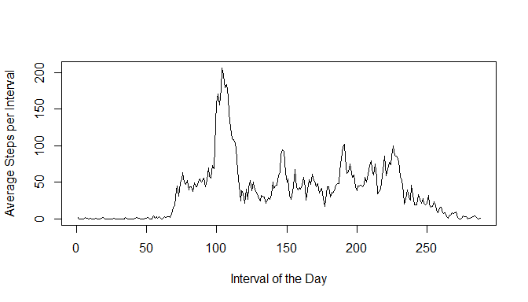
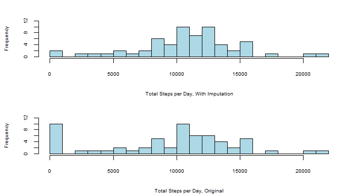
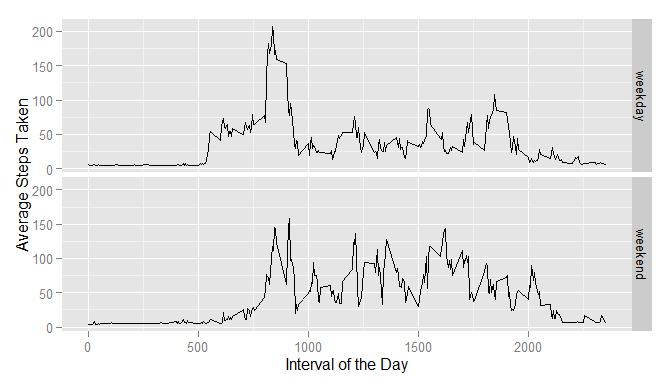

# Reproducible Research: Peer Assessment 1 by Alex Konkel


## Loading and preprocessing the data
First we'll need to unzip the file to make the data accessible.

```r
walk <- unzip('activity.zip')
```

And now we'll need to get the file loaded for analysis.
I'll also convert the date column to the date class.


```r
options(scipen=1, digits=2)
walk <- read.csv('activity.csv',header=TRUE,as.is=TRUE)
walk$date <- as.Date(walk$date,format='%Y-%m-%d')
```
And now we should be good to go.  The options call will affect how some numbers display later.

## What is mean total number of steps taken per day?
The instructions say that we can ignore the NAs, so the total number of steps per day  
is pretty straightforward.

```r
totPerDay <- tapply(walk$steps,walk$date,sum,na.rm=TRUE)
totPerDay
```

```
## 2012-10-01 2012-10-02 2012-10-03 2012-10-04 2012-10-05 2012-10-06 
##          0        126      11352      12116      13294      15420 
## 2012-10-07 2012-10-08 2012-10-09 2012-10-10 2012-10-11 2012-10-12 
##      11015          0      12811       9900      10304      17382 
## 2012-10-13 2012-10-14 2012-10-15 2012-10-16 2012-10-17 2012-10-18 
##      12426      15098      10139      15084      13452      10056 
## 2012-10-19 2012-10-20 2012-10-21 2012-10-22 2012-10-23 2012-10-24 
##      11829      10395       8821      13460       8918       8355 
## 2012-10-25 2012-10-26 2012-10-27 2012-10-28 2012-10-29 2012-10-30 
##       2492       6778      10119      11458       5018       9819 
## 2012-10-31 2012-11-01 2012-11-02 2012-11-03 2012-11-04 2012-11-05 
##      15414          0      10600      10571          0      10439 
## 2012-11-06 2012-11-07 2012-11-08 2012-11-09 2012-11-10 2012-11-11 
##       8334      12883       3219          0          0      12608 
## 2012-11-12 2012-11-13 2012-11-14 2012-11-15 2012-11-16 2012-11-17 
##      10765       7336          0         41       5441      14339 
## 2012-11-18 2012-11-19 2012-11-20 2012-11-21 2012-11-22 2012-11-23 
##      15110       8841       4472      12787      20427      21194 
## 2012-11-24 2012-11-25 2012-11-26 2012-11-27 2012-11-28 2012-11-29 
##      14478      11834      11162      13646      10183       7047 
## 2012-11-30 
##          0
```

And how about a histogram of that?


```r
hist(totPerDay,breaks=20,col='light blue',xlab='Total Steps per Day',main='Histogram of Steps per Day')
```

 

We can see that no recorded steps is about as frequent as the other most common bin (~10000 steps).
Finally, we want the mean and medium across days.  That's easy.

```r
meanSteps <- mean(totPerDay)
medianSteps <- median(totPerDay)
```

The mean is 9354.23 and the median is 10395.

## What is the average daily activity pattern?
Next, instead of looking at the level of days we'll look at the level of 5 minute increments within days.  
Here's a plot of the average number of steps per increment.

```r
totPerInc <- tapply(walk$steps,walk$interval,mean, na.rm=TRUE)
plot(totPerInc,type='l',xlab='Interval of the Day',ylab='Average Steps per Interval')
```

 

```r
maxInc <- which.max(totPerInc)
maxSteps <- totPerInc[maxInc]
```
The most steps, on average, occur during the 104th increment when an average of 206.17 steps are taken.  
Since the intervals are 5 minutes long, this occurs 520 minutes into the day, or 08:40 "military time".

## Imputing missing values
Step 1 for filling in the missing values is to determine how many there are.

```r
totMissing <- length(which(is.na(walk$steps)))
```
There are 2304 missing data points.

To fill in the missing points, I'm going to look ahead to the next part of the assignment a bit.
Since some days are completely missing, I don't want to just use the average within a day, because that would still be unknown.
Instead, I'm going to use a regression to predict the number of steps by the interval, day, and day of the week.

```r
walk$day <- weekdays(walk$date)
mod1 <- lm(steps ~ date+interval+day,data=walk)
missPoints <- subset(walk,is.na(steps))
predictions <- predict(mod1,new=missPoints[,2:4])
missPoints$steps <- predictions
```
So now we have the missing observations separated out and replaced with an imputed guess.  The model isn't great;  
the adjusted R squared is less than .01.  But the regression says that some days are predictive  
as is the interval in the day, so hopefully the imputation is better than a very simple average.

Now we want to make a new dataset that incorporates the imputation and look at the mean and median steps across days.  
To aid comparison to the original dataset, I'll put the earlier histogram here on the bottom.

```r
require(dplyr)
```

```
## Loading required package: dplyr
## 
## Attaching package: 'dplyr'
## 
## The following objects are masked from 'package:stats':
## 
##     filter, lag
## 
## The following objects are masked from 'package:base':
## 
##     intersect, setdiff, setequal, union
```

```r
walk2 <- walk %>% filter(!is.na(steps)) %>% bind_rows(missPoints) %>% arrange(date,interval)
totPerDay2 <- tapply(walk2$steps,walk2$date,sum,na.rm=TRUE)
par(mfrow=c(2,1),mar=c(4,4,2,0))
hist(totPerDay2,breaks=20,col='light blue',xlab='Total Steps per Day, With Imputation',main='',cex.axis=.6,cex.lab=.6,ylim=c(0,12))
hist(totPerDay,breaks=20,col='light blue',xlab='Total Steps per Day, Original',main='',cex.axis=.6,cex.lab=.6,ylim=c(0,12))
```

 

```r
meanSteps2 <- round(mean(totPerDay2),2)
medianSteps2 <- round(median(totPerDay2),2)
```
After imputaton, the mean is 10823.49 and the median is 11015.  
This is a difference of 1469.26 for the average and 620 for the median,
which is a noticeable difference.   We can also see a shift in the histogram, presumably because days with 0 steps due to NAs now have some.

## Are there differences in activity patterns between weekdays and weekends?
Finally, we want to compare weekend days and weekdays.  I already labeled the days of the week earlier, 
so now we just have to compress those into a new factor variable.  

```r
walk2 <- walk2 %>% mutate(day2 = ifelse(day=='Saturday' | day=='Sunday','weekend','weekday')) %>%
  mutate(day2 = as.factor(day2))
```
Now we want a line plot of the average number of steps per interval, separated for weekends and weekdays.

```r
require(ggplot2)
```

```
## Loading required package: ggplot2
```

```r
walk3 <- walk2 %>% group_by(interval,day2) %>% summarize(average=mean(steps))
ggplot(walk3,aes(x=interval,y=average))+geom_line()+facet_grid(day2~.)+labs(x='Interval of the Day', y='Average Steps Taken')
```

 

It looks like weekdays have a more prolonged build-up before the morning spike, and that spike is more consistent (there are two spikes on weekends).  More steps happen during the middle of the day on weekends, but the end of the day/evening appear fairly similar.
