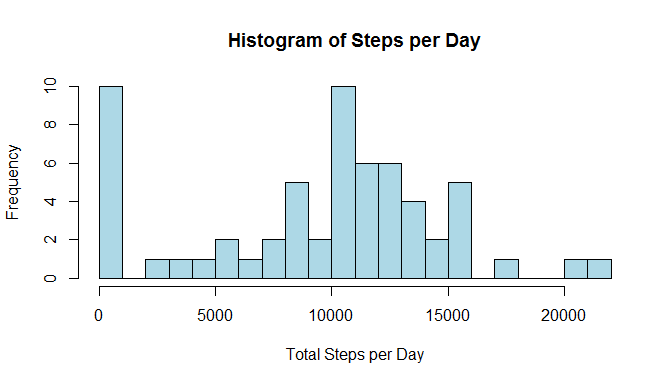

# Reproducible Research: Peer Assessment 1 by Alex Konkel


## Loading and preprocessing the data
First we'll need to unzip the file to make the data accessible.

```r
walk <- unzip('activity.zip')
```

And now we'll need to get the file loaded for analysis.
I'll also convert the date column to the date class.


```r
walk <- read.csv('activity.csv',header=TRUE,as.is=TRUE)
walk$date=as.Date(walk$date,format='%Y-%m-%d')
```
And now we should be good to go.

## What is mean total number of steps taken per day?
The instructions say that we can ignore the NAs, so the total number of steps per day  
is pretty straightforward.

```r
totPerDay <- tapply(walk$steps,walk$date,sum,na.rm=TRUE)
totPerDay
```

```
## 2012-10-01 2012-10-02 2012-10-03 2012-10-04 2012-10-05 2012-10-06 
##          0        126      11352      12116      13294      15420 
## 2012-10-07 2012-10-08 2012-10-09 2012-10-10 2012-10-11 2012-10-12 
##      11015          0      12811       9900      10304      17382 
## 2012-10-13 2012-10-14 2012-10-15 2012-10-16 2012-10-17 2012-10-18 
##      12426      15098      10139      15084      13452      10056 
## 2012-10-19 2012-10-20 2012-10-21 2012-10-22 2012-10-23 2012-10-24 
##      11829      10395       8821      13460       8918       8355 
## 2012-10-25 2012-10-26 2012-10-27 2012-10-28 2012-10-29 2012-10-30 
##       2492       6778      10119      11458       5018       9819 
## 2012-10-31 2012-11-01 2012-11-02 2012-11-03 2012-11-04 2012-11-05 
##      15414          0      10600      10571          0      10439 
## 2012-11-06 2012-11-07 2012-11-08 2012-11-09 2012-11-10 2012-11-11 
##       8334      12883       3219          0          0      12608 
## 2012-11-12 2012-11-13 2012-11-14 2012-11-15 2012-11-16 2012-11-17 
##      10765       7336          0         41       5441      14339 
## 2012-11-18 2012-11-19 2012-11-20 2012-11-21 2012-11-22 2012-11-23 
##      15110       8841       4472      12787      20427      21194 
## 2012-11-24 2012-11-25 2012-11-26 2012-11-27 2012-11-28 2012-11-29 
##      14478      11834      11162      13646      10183       7047 
## 2012-11-30 
##          0
```

And how about a histogram of that?


```r
hist(totPerDay,breaks=20,col='light blue')
```

 

We can see that no recorded steps is about as frequent as the other most common bin (~10000 steps).
Finally, we want the mean and medium across days.  That's pretty similar to the total.

```r
meanSteps <- mean(totPerDay)
medianSteps <- median(totPerDay)
```

The mean is 9354.23 and the median is 10395.

## What is the average daily activity pattern?


## Imputing missing values


## Are there differences in activity patterns between weekdays and weekends?
